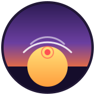

<p align="center">
  
</p>

<h1 align="center">DawnCast</h1>

<p align="center">
  A weather + disaster-alert tool endpoint for AI voice agents, built as a Next.js API route.
</p>

<p align="center">
  
  
  
  
</p>

---

## About

DawnCast serves live weather and disaster-alert data to a voice agent over a single API endpoint. It started as a standalone Express server tunneled through ngrok, and was rebuilt on Next.js so it can be deployed straight to Vercel with a permanent public HTTPS URL — no tunnel required, even for a live hackathon demo.

## Features

- **`/api/weather`** — a single JSON endpoint combining current weather and disaster-alert status
- **Live weather** via the OpenWeatherMap API
- **Disaster alerts** via [GDACS](https://www.gdacs.org/) (Global Disaster Alert and Coordination System), filtered to `orange`/`red` severity events affecting Bangladesh
- **Explicit `active_alert` flag** — always `true`/`false` from real GDACS data, never inferred from rain probability
- Drop-in tool endpoint for [AssemblyAI](https://www.assemblyai.com/) voice agents (or any agent framework that can call an HTTPS tool URL)

## Project structure

```
app/
  api/weather/route.js   → the endpoint the voice agent calls
  layout.js              → minimal required root layout
  page.js                → placeholder homepage
lib/
  openweather.js         → OpenWeatherMap fetcher
  gdacs.js                → GDACS disaster-alert fetcher
public/
  dawncast-logo.svg      → project logo
dawncast.py               → setup / agent-config helper script
```

## Getting started

### Prerequisites

- Node.js 18+
- An [OpenWeatherMap](https://openweathermap.org/api) API key

### Local setup

```bash
npm install
cp .env.local.example .env.local
# edit .env.local and add your real OPENWEATHERMAP_API_KEY
npm run dev
```

Test the endpoint:

```bash
curl http://localhost:3000/api/weather
```

## Deployment

Deploy to **Vercel** — it's built by the Next.js team, so it's effectively a one-command deploy, and gives you a permanent public HTTPS URL with no tunneling needed.

```bash
npm i -g vercel
vercel
```

Then add `OPENWEATHERMAP_API_KEY` as an environment variable in the Vercel dashboard (**Project → Settings → Environment Variables**) and redeploy:

```bash
vercel --prod
```

You'll get a URL like:

```
https://dawncast.vercel.app/api/weather
```

Use that as the `WEATHER_TOOL_URL` when running AssemblyAI's `create_dawncast.py` setup script.

## Notes

- `active_alert` is always explicit (`true`/`false`) from GDACS data — never inferred from rain probability, per the agent's own instructions.
- GDACS alerts are filtered to `orange`/`red` severity and to events listing Bangladesh as an affected country. GDACS doesn't break alerts down to city level, so this is country-wide precision, not Sylhet-specific.
- If your OpenWeatherMap key is on the classic free tier (not One Call 3.0), the fetcher can be swapped to use `/data/2.5/forecast` instead — open an issue or PR.

## License

No license specified yet — add one (e.g. MIT) if you plan to open this up for others to use.